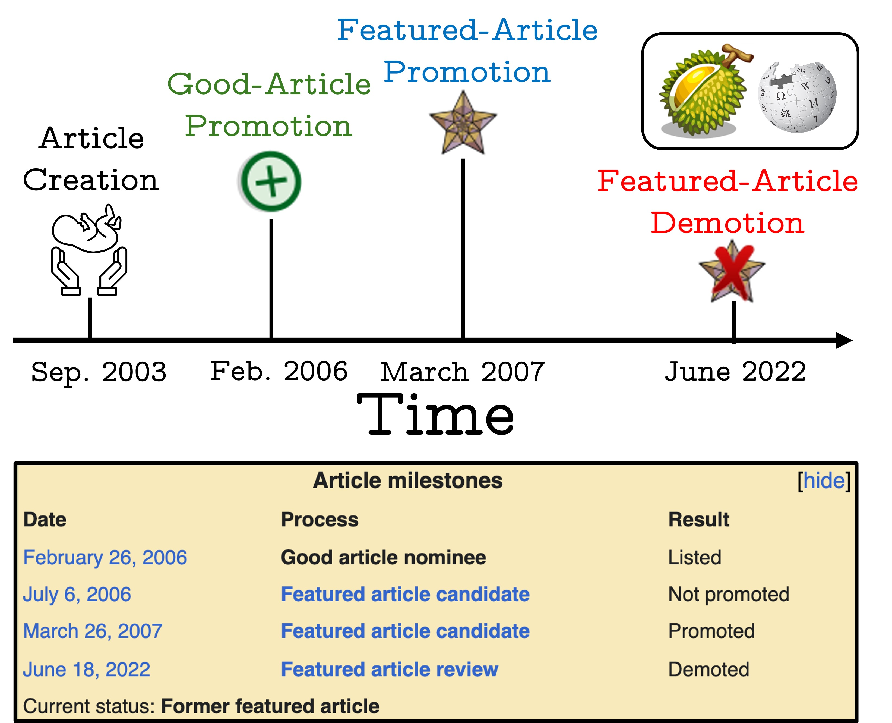

# sustainable-high-quality-wikis

This repository contains the code that supports the academic paper titled **"A Test of Time: Predicting the Sustainable Success of Online Collaboration in Wikipedia."**

The paper is currently under review. A citation to the preprint manuscript will be shared here in soon.

The abstract of the paper is as follows: 
>The Internet has significantly expanded the potential for global collaboration, allowing millions of users to contribute to collective projects like Wikipedia. While prior work has assessed the success of online >collaborations, most approaches are time-agnostic, evaluating success without considering its longevity.
>Research on the factors that ensure the long-term preservation of high-quality standards in online collaboration is scarce.
>In this study, we address this gap. We propose a novel metric, ‘Sustainable Success’, which measures the ability of collaborative efforts to maintain their quality over time.
>Using Wikipedia as a case study, we introduce the SustainPedia dataset, which compiles data from over 40K Wikipedia articles, including each article’s sustainable success label and more than 300 explanatory features such >as edit history, user experience, and team composition.
>Using this dataset, we develop machine learning models to predict the sustainable success of Wikipedia articles.
>Our best-performing model achieves a high AU-ROC score of 0.88 on average. Our analysis reveals important insights. For example, we find that the longer an article takes to be recognized as high-quality, the more likely >it is to maintain that status over time (i.e., be sustainable). Additionally, user experience emerged as the most critical predictor of sustainability. Our analysis provides insights into broader collective actions beyond >Wikipedia (e.g., online activism, crowdsourced open-source software), where the same social dynamics that drive success on Wikipedia might play a role. We make all data and code used for this study publicly available for >further research.

## Data
We use different data sources for this research:

| Feature Set      | Num. of Features | Main File/Function                             | Comments                                                                 |
|------------------|------------------|------------------------------------------------|--------------------------------------------------------------------------|
| Network          | 27               | extract_structural_features                    |                                                                          |
| Topics           | 247              | topic_per_article.py                           | Talk pages content has to be first downloaded                            |
| Team Composition | 5                | meta_and_editing_structural_features_extractor | Row 3, Cell 4                                                            |
| Discussions      | 36               | discussions_features_extractor                 | DL predictions are created using the 'talkpages_text_prediction.py' code |
| Edit History     | 7                | meta_and_editing_structural_features_extractor | The Was-a-Good-Article feature is imported in a different code           |
| user Experience  | 4                | user_level_generate_modeling_features.py       | The 'user_level_generate_credit_features.py' code has to run first       |

We are aware that reproducing the exact same features we created for modeling is complicated. Hence, we wish to highlight the following:

* We share the modeling data frames we use in their final format (for both `FA` and `GA` use cases tested). See under the 'data' folder.
* We use the Wikipeida dump files while processing the data and creating features.
* We also use the talk pages for data creation.
* Per Wikipedia articles, we create a Python object that contains a lot of the information about it. The creation process code is in the `article_assessment_objects_creation.py` file.
* For further questions and comments, please don't hesitate to contact us over email (isabrah@umich.edu, Abraham).
